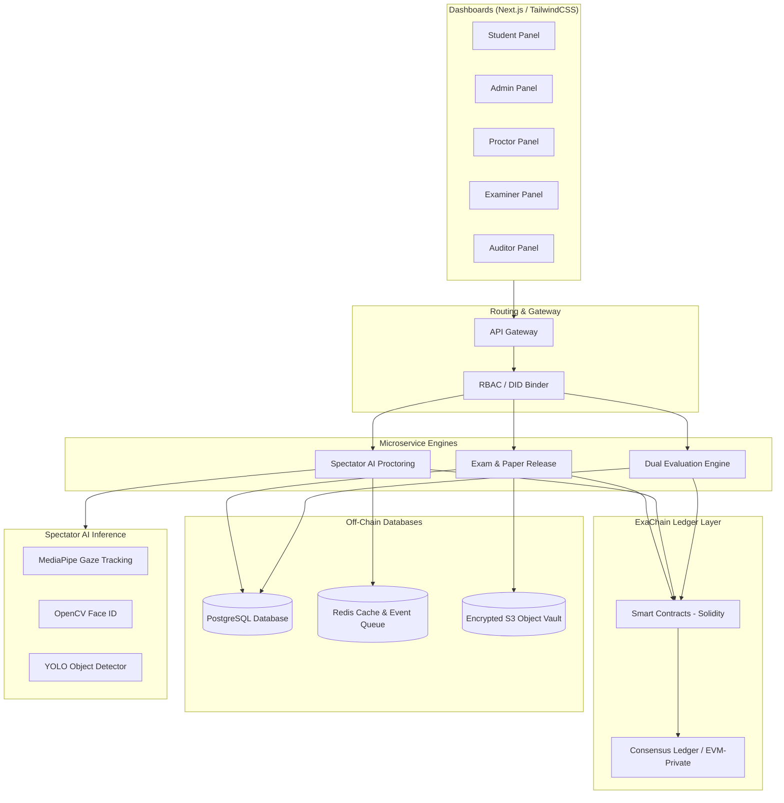
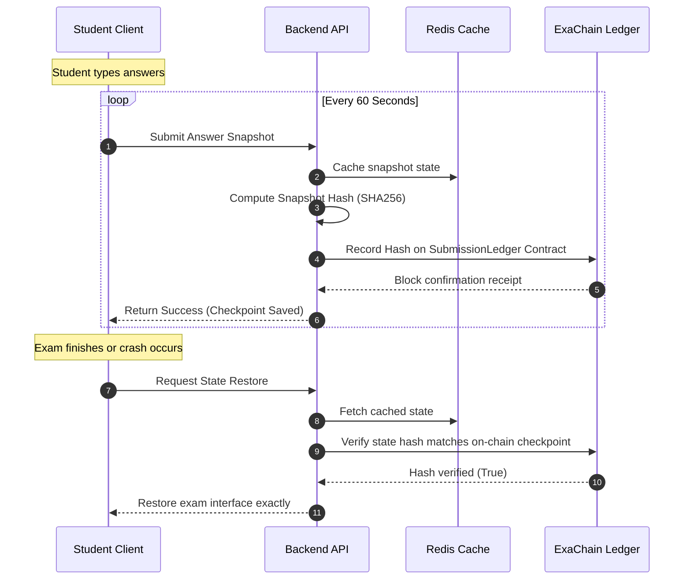
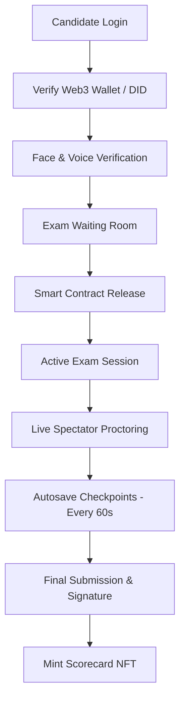

# 🏆 IntelliExaChain — Hackathon Submission Master Document
## 🚀 AI-Powered • Blockchain-Backed • Next-Generation Examination Infrastructure
**Theme:** Examinations  
**Team:** Visionary Coders  
**Core Motto:** *Trust Every Exam. Verify Every Result.*

---

## 📌 Document Overview
This document compiles all critical materials required for the hackathon submission, structuring them into four key modules:
1. **Product Requirement Document (PRD)** — The vision, goals, functional scope, and user stories.
2. **System Architecture & Technical Stack** — Detailed technical blueprints, databases, AI models, and blockchain implementation details.
3. **UI/UX Design Framework** — User flows, layout wireframes, and interaction paradigms.
4. **Presentation Slide Deck** — The official 12-slide pitch deck satisfying all hackathon guidelines (concise, visual-first, under 15 slides, including prototype demo details).

---

# 📖 Module 1: Product Requirement Document (PRD)

## 1.1 Product Vision
**IntelliExaChain** is a decentralized, secure, and intelligent examination orchestration platform. By combining a permissioned blockchain (**ExaChain**), automated smart contracts, and real-time AI-assisted monitoring (**Spectator**), the platform establishes a tamper-proof ecosystem for online, hybrid, and high-stakes assessments. 

We solve the fundamental security and trust challenges of modern assessments, moving from centralized, easily manipulated databases to an immutable, verifiable ledger of academic performance.

## 1.2 Problem Statement
Legacy examination systems (both digital and physical) suffer from systemic vulnerabilities:
*   **Question Paper Leaks:** Papers are compromised before the examination window during storage or transit.
*   **Identity Fraud & Impersonation:** Proxies take exams on behalf of registered students, bypassing weak online checks.
*   **Post-Exam Manipulation:** Grades, databases, or response files are modified by corrupt internal actors or external hackers.
*   **Certificate Forgery:** Fake degrees and credentials proliferate because authenticating them manually is slow and expensive.
*   **Fragmented Audit Trails:** Logs are easily cleared or edited by database administrators, leaving no trace of tampering.

## 1.3 Goals & Non-Goals
### Goals
*   **Zero Leakage Vault:** Keep papers encrypted and locked on-chain until the exact exam start time.
*   **Robust Verification:** Verify candidate identity continuously through biometric validation and Web3 academic wallets.
*   **Immutable Audit Logs:** Log all actions (paper uploads, student access, overrides, AI warnings) on a distributed ledger.
*   **AI-Driven Vigilance:** Deploy low-latency computer vision and audio analysis to flag dishonesty in real-time.
*   **Instant Verification:** Allow third-party recruiters/universities to instantly verify credentials via QR codes or transaction hashes.

### Non-Goals
*   Replacing human invigilator oversight completely (the system assists and flags anomalies, human proctors make final decisions).
*   Storing raw biometric images or video feeds directly on-chain (only encrypted templates and cryptographic hashes are written on-chain).
*   Using a public proof-of-work blockchain (which adds high latency and transaction costs); instead, using a permissioned, energy-efficient ledger.

## 1.4 Target Personas
1.  **Exam Administrator:** Configures exams, uploads encrypted papers, defines roster, reviews system-wide anomalies.
2.  **Invigilator / Proctor:** Monitors the live student video/audio feeds, receives real-time AI flags, and enters override remarks.
3.  **Student / Candidate:** Registers biometrics, completes pre-exam checks, takes the exam, and submits signed answers.
4.  **Examiner / Evaluator:** Grades subjective responses via a dual grading panel, cross-checking AI pre-scores.
5.  **Auditor / Compliance Inspector:** Performs post-exam forensic checks by verifying block logs and grade change histories.

## 1.5 Unique Selling Proposition (USP)
*   **Spectator (AI Proctoring):** Continuous monitoring of webcam, eye gaze, background objects, and acoustic signals. Alerts are streamed in real time and stored immutably on-chain.
*   **ExaChain (Decentralized Ledger):** Time-locked smart contracts release decryption keys only when scheduled times are reached and candidate biometric checks pass. Answers are continuously saved and hashed on-chain (autosave checkpoints).
*   **Web3 Identity Integration:** Students authenticate through a decentralized ID (DID) wallet.
*   **Third-Party Verification:** Employers bypass manual document checks by querying the blockchain directly via QR or transaction hashes, taking less than 5 seconds.
*   **Authority Website Co-existence:** Students register and manage profiles on their regular authority portals (e.g., NTA, UPSC), but launch the exam via IntelliExaChain's secure proctored frame, linking the two seamlessly.

---

## 1.6 User Stories & Acceptance Criteria

```
+---------------------------------------------------------------------------------------------------+
| Epic / User Story                     | Acceptance Criteria                                       |
|---------------------------------------+-----------------------------------------------------------|
| Epic 1: Exam Setup                    |                                                           |
| - US 1.1: Create Exam                 | Save schedule, rules, and student roster. Lock settings   |
|                                       | once published.                                           |
| - US 1.2: Upload Paper Vault          | Encrypt file off-chain, compute SHA256 hash, write hash  |
|                                       | to blockchain, enforce smart contract time-lock.          |
|---------------------------------------+-----------------------------------------------------------|
| Epic 2: Candidate Verification        |                                                           |
| - US 2.1: Register Biometric ID       | Register face/voice template. Encrypt template data.      |
| - US 2.2: Live Identity Verification  | Compare live face with template. Lock exam entrance       |
|                                       | unless verification passes or proctor manually overrides. |
|---------------------------------------+-----------------------------------------------------------|
| Epic 3: Secure Exam Access            |                                                           |
| - US 3.1: Timed Unlock                | Decryption keys released only at exact schedule time.     |
| - US 3.2: Access Audit Logging        | Log user ID, timestamp, and block number for all access.  |
|---------------------------------------+-----------------------------------------------------------|
| Epic 4: Proctoring & Integrity        |                                                           |
| - US 4.1: Real-time AI Alerts         | Flag gaze shift, multiple faces, object or audio anomaly.|
| - US 4.2: Autosave Checkpointing      | Periodically hash responses, commit hashes on-chain.      |
|---------------------------------------+-----------------------------------------------------------|
| Epic 5: Evaluation & Certification    |                                                           |
| - US 5.1: Dual Evaluation Grading     | Auto-grade objectives; route subjectives to faculty.      |
| - US 5.2: NFT Credential Generation   | Commit final score to ledger, mint NFT/QR certificate.    |
+---------------------------------------------------------------------------------------------------+
```

---

# 🏗️ Module 2: System Architecture & Technical Stack

## 2.1 Architecture Principles
1.  **Permissioned by Default:** Consortium blockchain ensures only validating institutional nodes participate.
2.  **Off-Chain Data / On-Chain Trust:** Keep heavy files (webcam video, candidate response blobs) off-chain. Commit cryptographic hashes, access credentials, audit logs, and grade proofs on-chain.
3.  **Least Privilege Access:** Role-Based Access Control (RBAC) restricts users to their exact functional dashboard.
4.  **Continuous Ledger Anchoring:** Answer states are periodically hashed and stored to prevent post-facto rewriting of responses.

## 2.2 Component Diagram



---

## 2.3 Core Data Flows

### 2.3.1 Question Paper Secure Release
1.  **Upload:** Administrator uploads the question paper in the Admin Panel.
2.  **Encryption:** The file is encrypted using AES-256 on the backend, generating `Paper_Hash` (SHA256).
3.  **Anchoring:** `Paper_Hash` and `Unlock_Timestamp` are registered in the `ExamRegistry` smart contract.
4.  **Storage:** The encrypted paper file is stored in S3 Object Storage.
5.  **Release:** When a student enters the exam room after passing verification, the client requests the decryption key. The `AccessControl` smart contract verifies:
    *   Current time $\ge$ `Unlock_Timestamp`
    *   Candidate is on the allowed roster
    *   Biometric status is marked as `VERIFIED`
6.  **Decryption:** Key is delivered, paper decrypts on-the-fly in browser memory, and the access log is immutably stored in the ledger.

### 2.3.2 Answer Autosave Checkpointing


---

## 2.4 Smart Contract Designs
*   **ExamRegistry.sol:** Tracks exam metadata, schedules, student rosters, and question hashes.
*   **AccessControl.sol:** Enforces time-locks and logs candidate entry events.
*   **SubmissionLedger.sol:** Anchors periodic answer hashes, ensuring student work cannot be altered.
*   **ScoringLedger.sol:** Commits grading proofs, evaluator digital signatures, and audit logs for modified grades.
*   **AuditTrail.sol:** Generic event logger registering proctor flags, overrides, and administrative adjustments.

## 2.5 Recommended Technical Stack
*   **Frontend:** Next.js (App Router), React, TypeScript, TailwindCSS, Framer Motion, WebRTC/WebSockets (live camera proctoring feeds).
*   **Backend:** Node.js with NestJS framework, Socket.io (real-time communication), TypeScript, REST / GraphQL APIs.
*   **Blockchain & Contracts:** Solidity, Ethereum Private Network / Hyperledger Besu (EVM compatible) or Hyperledger Fabric (Go chaincode).
*   **Database & Cache:** PostgreSQL (relational storage of metadata), Redis (caching and high-throughput proctoring alert queues).
*   **Storage:** AWS S3 (encrypted document/media vault), AWS KMS / HashiCorp Vault (key management).
*   **AI Layer:** Python microservices, OpenCV (face detection), MediaPipe (face mesh & eye-gaze tracking), YOLO (device and secondary person detection), Whisper (speech recognition).
*   **DevOps:** Docker, Kubernetes, GitHub Actions (CI/CD), Prometheus & Grafana (monitoring).

---

# 🎨 Module 3: UI/UX Design Framework

## 3.1 Design Principles
1.  **Trust-Heavy Visual Cueing:** Clear, glowing status elements indicating secure connection, blockchain sync, and proctoring status.
2.  **Low-Friction Candidate Experience:** Minimum distractions during the examination. High-contrast, clean typography to prevent eye strain.
3.  **Proctor Alert Hierarchy:** Categorized visual notifications (Green, Yellow, Red) to allow human proctors to prioritize high-risk anomalies.

## 3.2 Key Dashboards Wireframes

### 3.2.1 Student Exam Room Layout
```text
+--------------------------------------------------------------------------+
|  IntelliExaChain | JEE Exam - Session 1 | ⏱️ Time Left: 01:45:12 | Sync: OK  |
+--------------------------------------------------------------------------+
|                                     |                                    |
| [Question Pane]                     | [Answer Workspace]                 |
| Q3. Solve for x:                    | Write code or choose option:       |
|                                     |                                    |
|   f(x) = sin(x) + cos(x)            | (A) x = pi / 4                     |
|                                     | (B) x = pi / 2                     |
|                                     | (C) x = 0                          |
|                                     | (D) None of these                  |
|                                     |                                    |
|                                     | Selected: (A)                      |
|                                     |                                    |
+--------------------------------------------------------------------------+
|  [Prev Question]   [Flag Question]  |     [Save Checkpoint]  [Submit]   |
+--------------------------------------------------------------------------+
| 📷 Proctor Cam Active | AI Status: Gaze Verified | Block Height: #45109  |
+--------------------------------------------------------------------------+
```

### 3.2.2 Live AI Proctor Dashboard
```text
+--------------------------------------------------------------------------+
|  Proctor Portal | Active Exams: 3 | Candidates: 154 | Alerts: 12 Active  |
+--------------------------------------------------------------------------+
|  LIVE CANDIDATE FEEDS              |  SELECTED CANDIDATE DETAIL          |
|  +---------------+---------------+ |  Name: John Doe                     |
|  |  Student A    | ⚠️ Student B  | |  Exam ID: JEE_2026_09               |
|  |  [Low Risk]   | [Gaze Alert]  | |  Status: 🚨 HIGH RISK (Score: 89%)  |
|  +---------------+---------------+ |  Live Feed:                         |
|  | 🚨 Student C  |  Student D    | |  +-------------------------------+  |
|  | [Audio Flag]  |  [Low Risk]   | |  |  [RED BOX: Eye Gaze Deviated] |  |
|  +---------------+---------------+ |  +-------------------------------+  |
|                                    |  Incident Log:                      |
|                                    |  - 23:14:02 : Gaze Left (Yellow)    |
|                                    |  - 23:14:15 : Phone Detected (Red)  |
|------------------------------------+-------------------------------------|
| Actions: [Warn Candidate]   [Trigger Verification]   [Mark Disqualified] |
+--------------------------------------------------------------------------+
```

---

## 3.3 Student Examination Flow


---

# 🚀 Module 4: Presentation Slide Deck
*Designed in obsidian glassmorphism. Optimized for brevity, high visual layout, and compliance with the 15-slide maximum.*

---

### Slide 1: Title Slide
*   **Headline:** IntelliExaChain
*   **Sub-headline:** Trust Every Exam. Verify Every Result.
*   **Description:** AI-Powered, Blockchain-Backed, Next-Generation Examination Infrastructure.
*   **Presented By:** Team Visionary Coders
*   **Theme Aesthetic:** Deep dark obsidian backdrop, glowing cyan trust rings, minimalist typography.

---

### Slide 2: The Core Problem
*   **Headline:** The Examination Trust Crisis
*   **Points:**
    *   **Leaks:** Question papers leaked online prior to the start of exams.
    *   **Impersonation:** Proxy students taking exams, cheating facial recognition check-ins.
    *   **Tampering:** Direct manipulation of grading databases by internal or external actors.
    *   **Certificate Fraud:** Fake degree verification takes weeks and demands manual review.

---

### Slide 3: The IntelliExaChain Solution
*   **Headline:** The Decentralized Trust Layer
*   **Points:**
    *   **ExaChain Vault:** Encrypted question papers unlocked by Solidity smart contracts at the exact scheduled second.
    *   **Spectator AI:** Continuous multi-factor proctoring analyzing gaze, background audio, objects, and face integrity.
    *   **Autosave Checkpointing:** Frequent cryptographic anchoring of student responses directly to the blockchain.
    *   **Instant Verification:** QR codes that retrieve immutable scoring hashes from the ledger in under 5 seconds.

---

### Slide 4: System Architecture
*   **Headline:** Secure Microservices & Ledger Infrastructure
*   **Diagram:** *Refer to the detailed architectural diagram in Section 2.2.*
*   **Key Highlights:**
    *   Next.js frontend dashboards utilizing WebSockets for real-time monitoring.
    *   NestJS gateway managing microservice routing.
    *   Decentralized off-chain S3 storage combined with a private EVM-compatible ledger (Besu/Quorum) for audit trails.

---

### Slide 5: ExaChain: Cryptographic Vault & Time Locks
*   **Headline:** Immutability in Action
*   **Points:**
    *   **Double Envelope Encryption:** Questions are stored AES-encrypted. The decryption keys are controlled by smart contracts.
    *   **Autosave Ledger:** If a student's system crashes, answer snapshots are restored and verified against on-chain block hashes.
    *   **Irreversible Audits:** System administrator actions, proctor warnings, and examiner updates leave permanent blockchain tracks.

---

### Slide 6: Spectator: Real-Time AI Proctoring Engine
*   **Headline:** Continuous Vigilance
*   **Points:**
    *   **Face ID / Voice ID:** Continuous authentication during the exam to prevent swap-outs.
    *   **Gaze Estimation:** MediaPipe-based landmarks monitoring focus and eye movement.
    *   **Object Recognition:** YOLO models instantly flagging secondary monitors, phones, or books.
    *   **Acoustic Profiling:** Audio anomaly detection identifying whispered assistance or spoken collusion.

---

### Slide 7: Web3 Academic Identity & QR Verification
*   **Headline:** Frictionless Trust for Students & Recruiters
*   **Points:**
    *   **Decentralized Identifier (DID):** Secure, self-sovereign user profiles that do not store plain biometric pictures on-chain.
    *   **Dynamic NFT Scorecards:** Completed exams auto-generate cryptographic badges containing grades and proof keys.
    *   **One-Click Verifier:** Recruiters scan a certificate QR code, querying the blockchain to verify GPA/grades instantly.

---

### Slide 8: The Dual Evaluation Engine
*   **Headline:** Objective Automation & Auditable Moderation
*   **Points:**
    *   **Auto-Scoring Layer:** Objectives checked via smart contract logic, eliminating human bias.
    *   **Subjective Workspace:** Human grading and feedback are routed through the examiner dashboard.
    *   **Traceable Appeals:** If a grade is modified during review, the ledger logs the revision, the examiner ID, and the justification.

---

### Slide 9: Technical Stack
*   **Headline:** Modern, Secure, High-Performance Stack
*   **Grid:**
    *   *Frontend:* Next.js, TypeScript, TailwindCSS, Framer Motion.
    *   *Backend:* NestJS, Redis, WebSockets, PostgreSQL.
    *   *Blockchain:* Solidity, Hyperledger Fabric / Besu.
    *   *AI Models:* OpenCV, YOLO, MediaPipe, Whisper.
    *   *DevOps:* Docker, Kubernetes, AWS S3.

---

### Slide 10: Live Prototype Demo
*   **Headline:** Interactive Multi-Portal Demonstration
*   **Features Covered:**
    *   **Interactive Multi-Role Selector:** Switch between Admin, Student, Proctor, Examiner, Auditor, and Recruiter.
    *   **Active Student Exam Room:** Live JEE mock questions with automatic on-chain checkpoint saves.
    *   **Live Proctor Screen:** Real-time visual streams with red bounding box overlays highlighting anomalies.
    *   **Block Explorer:** Audit tool viewing transactions and ledger state changes.

---

### Slide 11: Competitive Advantage
*   **Headline:** IntelliExaChain vs. Legacy Platforms

```
+---------------------------------------------------------------------------------------------------+
| Feature                    | Legacy Examination Systems           | IntelliExaChain               |
|----------------------------+--------------------------------------+-------------------------------|
| Ledger Model               | Centralized Database (Editable)      | Permissioned Chain (Immutable)|
| Paper Security             | High leak risk (Digital/Physical)   | Decrypted at Exam Start Time  |
| Proctoring                 | Manual proctors or simple tab-locks  | Spectator AI + Human Oversight|
| Grading Trust              | Opaque, vulnerable to database edits  | Auditable, version-controlled |
| Verification               | Weeks of manual verification checks  | Instant verification QR       |
+---------------------------------------------------------------------------------------------------+
```

---

### Slide 12: Roadmap & Future Horizon
*   **Headline:** The Future of Global Assessments
*   **Timeline:**
    *   **Phase 1 (Current):** Working multi-dashboard prototype, secure vault release, and core proctoring alerts.
    *   **Phase 2 (Scalability):** Partnerships with national testing authorities, and scaling transactions.
    *   **Phase 3 (Self-Sovereign Identity):** Universal Web3 academic profiles recognized internationally.
    *   **Phase 4 (Autonomous Evaluation):** Generative AI providing deep qualitative feedback for subjective evaluations.

---

# 🏆 Team Visionary Coders
*   **Vaibhav Shaw** — Team Lead, Product Strategist, PM & AI Specialist
*   **Ishant Joshi** — Frontend Developer, UI Engineer, AI Specialist
*   **Md. Aftab Uddin** — Backend Developer, Security & System Integrations

---
*End of Document. Configured for submission.*
