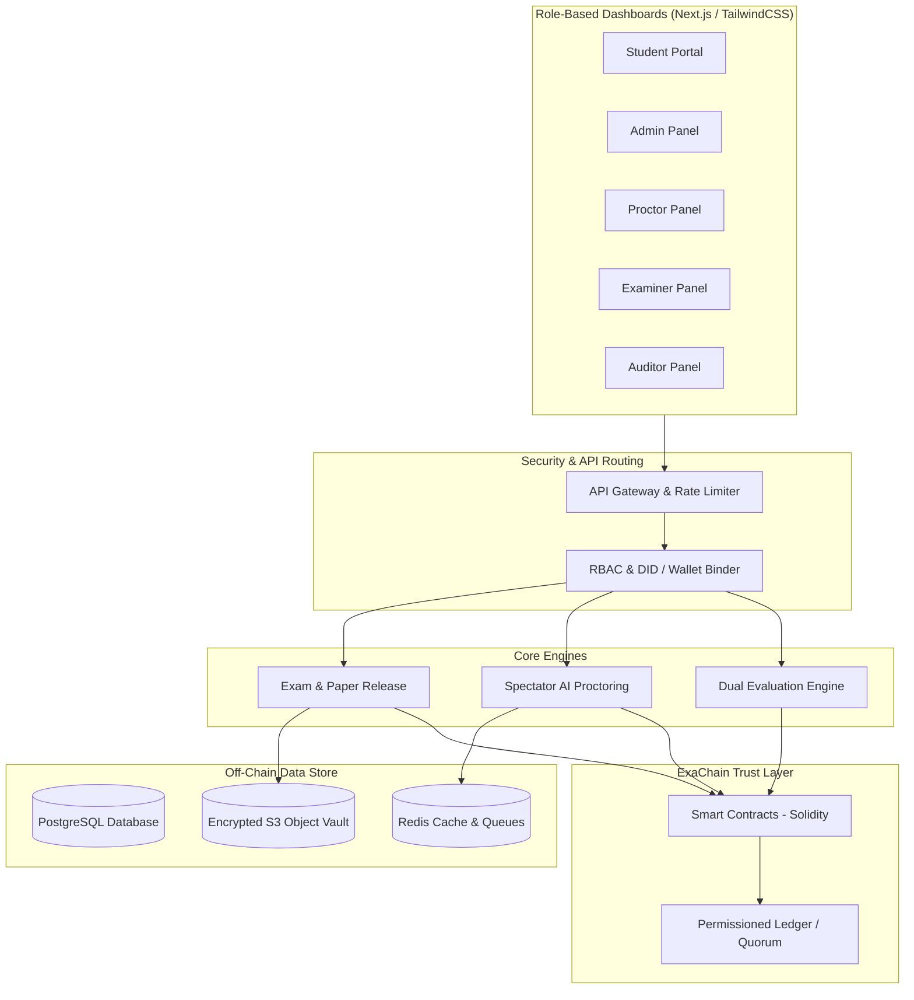

# 🚀 IntelliExaChain Presentation Slide Deck

---
# Presentation

· Max 15 slides

. Demo must be included

. Keep it concise and visual
. Avoid excessive text

Suggested Structure:
|Problem Statement|
Solution| Key Features|
Tech Stack| Architecture|
Demo| Future Scope|

---

## Slide 1: Title Slide
### 🚀 IntelliExaChain: Next-Gen Exam Infrastructure
**Sub-title:** Trust Every Exam. Verify Every Result.
*AI-Powered • Blockchain-Backed • Next-Generation Examination Infrastructure*

* **Presented by:** Team Visionary Coders
* **Core Value:** Securing the complete examination lifecycle (Pre-exam, During-exam, Post-exam)
* **Aesthetic Theme:** Dark obsidian glassmorphism, glowing cyan trust highlights, deep indigo brand elements.

> **Visual Design Cues:**
> Central glowing logo with interlocking cyan blockchain rings overlaying a deep navy background, surrounded by security badges (AI-Powered, Hyperledger, Solidity, Secure).

---

## Slide 2: The Core Problem
### 🚨 Security, Operational & Scalability Gaps
*Traditional examination ecosystems are outdated, fragile, and vulnerable to systemic failures.*

* **Question Paper Leaks:** Leakage at printing presses, distribution hubs, or via early digital hacks.
* **Candidate Impersonation:** Proxy attendance, identity spoofing, and forged physical identity cards.
* **Result Manipulation:** Post-exam database breaches, grading tampering, or unauthorized score changes.
* **Certificate Fraud:** Proliferation of fake degrees requiring slow, manual, and expensive verification.
* **Operational Inefficiency:** High logistic costs, lack of audit trails, and inability to handle millions of candidates securely.

> **Visual Design Cues:**
> A two-column split layout. The left column lists critical security vulnerabilities marked with red alert badges; the right column highlights operational friction points and cost impact charts.

---

## Slide 3: The Ultimate Solution
### 💡 AI-Powered & Blockchain-Backed Ecosystem
*IntelliExaChain integrates blockchain immutability and AI vigilance to build a tamper-proof system.*

* **ExaChain (Blockchain Vault):** Question papers are encrypted and locked in a decentralized vault.
* **Spectator (AI Proctoring):** Continuous webcam, audio, eye-gaze, and environment monitoring.
* **Autosave Checkpointing:** Live candidate answers are continuously hashed and anchored on-chain.
* **Web3 Academic Identity:** Privacy-preserving Decentralized IDs (DIDs) linking biometrics securely.
* **Instant QR Verification:** One-click credential validation for recruiters and educational institutions.

> **Visual Design Cues:**
> A circular diagram showcasing the 5 pillars of the IntelliExaChain trust layer radiating outward from a central "Secure Exam Room" node.

---

## Slide 4: System Architecture
### 🏗️ High-Level System Architecture
*A permissioned, secure, microservice-based architecture ensuring high throughput and absolute data privacy.*

> **Visual Design Cues:**
> Vertical layered architecture diagram highlighting clear separations between UI clients, gateway routing, service engines, and storage/trust databases.

---

## Slide 5: ExaChain: The Trust Layer
### ⛓️ Cryptographic Security & Timed Smart Release
*Securing exam papers, response sheets, and grade records immutably.*

* **Encrypted Question Vault:** Papers are encrypted and stored off-chain. Only SHA256 hashes reside on-chain.
* **Smart Contract Time Locks:** Decryption keys are locked until the scheduled start time and candidate identity is validated.
* **Autosave Checkpoints:** Candidate answers are hashed and anchored to the ledger at frequent intervals, blocking any retrofitted changes.
* **On-Chain Audit Trail:** Every admin upload, paper access, proctor override, and grade change is logged to the ledger.

> **Visual Design Cues:**
> Side-by-side workflow. Left: A timeline illustrating the secure release sequence. Right: The continuous hashing sequence showing how answer checkpoints build an unbroken chain of custody.

---

## Slide 6: Spectator: AI Proctoring Engine
### 🎥 Live Behavioural Monitoring & Impersonation Prevention
*Advanced computer vision and audio analytics working in real-time to guarantee exam integrity.*

* **Biometric Face & Voice ID:** Constant candidate validation at login and during the exam to prevent proxy attendance.
* **Eye & Gaze Tracking:** Identifies prolonged deviation from the screen to detect off-camera cheating aids.
* **Object & Person Detection:** Detects secondary screens, smartphones, or unauthorized persons entering the camera frame.
* **Audible Anomaly detection:** Detects background voices or speech to identify spoken collusion.
* **Immutability of Alerts:** Every high-risk proctoring alert is written directly to the ExaChain ledger.

> **Visual Design Cues:**
> Mock UI of the Proctor Dashboard. Features multi-feed camera grid displays with red bounding boxes highlighting anomalies, live risk charts, and a sidebar showing blockchain-anchored alerts.

---

## Slide 7: Candidate & Verification Ecosystem
### 🪪 Web3 Academic ID & Instantly Verifiable Credentials
*Putting digital credentials in the hands of candidates while enabling instant validation.*

* **Decentralized Identifier (DID):** Students receive a Web3 academic identity linked to their verified credentials.
* **Privacy-Preserving Biometrics:** Biometric profiles are stored as encrypted hashes/reference templates, never as raw data.
* **Dynamic NFT Certificates:** Certificates are issued as secure digital credentials on-chain.
* **Recruiter QR Verification:** Employers scan a QR code or enter a hash ID, triggering an automated on-chain verification that validates candidate results in under 5 seconds.

> **Visual Design Cues:**
> Three-step visual sequence: 
> 1. Student completes exam -> 2. Smart Contract generates NFT credential -> 3. Recruiter scans QR code to instantly pull cryptographically proven scorecard.

---

## Slide 8: The Dual Evaluation Engine
### ⚖️ Multi-Layer Grading & Grade Audits
*Ensuring fast, objective, and unbiased evaluation while maintaining a transparent appeal process.*

* **Layer 1: AI Evaluation:** Objective questions are graded immediately via smart contract rules. Subjective answers are pre-scored and summarized by AI.
* **Layer 2: Faculty Moderation:** Subjective answers are routed to examiners for human grading and feedback.
* **Layer 3: Blockchain Commitment:** Final grading results are committed to the ledger.
* **Auditable History:** Any modification to scores must go through an approval workflow, creating a versioned history.

> **Visual Design Cues:**
> Flowchart displaying answer submissions moving through automated AI grading, examiner review, and final cryptographic signing on the blockchain.

---

## Slide 9: Technical Stack
### 💻 Architecture & Technologies
*Built using enterprise-grade, high-performance, and secure tech stacks.*

* **Frontend:** Next.js, React.js, TailwindCSS, Framer Motion (smooth, responsive, micro-animated dashboards).
* **Backend:** Node.js (NestJS framework), REST & WebSockets, Redis (caching and streaming real-time alerts).
* **Blockchain:** Hyperledger Fabric (permissioned institutional consensus) & Private Ethereum/Quorum (smart contract portable engine).
* **AI Models:** MediaPipe (face & gaze landmarks), OpenCV (face recognition), YOLO (object detection), Whisper (audio analysis).
* **Infrastructure:** AWS, Docker, Kubernetes, PostgreSQL, IPFS (distributed content addressing).

> **Visual Design Cues:**
> Clean 4-column tech grid highlighting Frontend, Backend, Blockchain, and AI components with tech logos/icons.

---

## Slide 10: The Live Prototype Demo
### 🖥️ Interactive Multi-Portal Experience
*A functional end-to-end prototype showcasing real-world flows.*

* **Splash Video Loader:** A stunning 10-second opening animation setting the premium visual stage.
* **Multi-Role Selector:** Instant role switching between Admin, Student, Proctor, Examiner, Auditor, and Recruiter.
* **Student Exam Room:** Answering mock JEE/GATE/UPSC exams with live timers and autosave checkpoints.
* **AI Proctor Panel:** Live streams showing simulated cheating alerts being pushed to the proctor and logged to the ledger.
* **Auditor Ledger Explorer:** Real-time block explorer inspecting ExaChain hashes and transaction histories.
* **Recruiter Verifier:** Scanning student DIDs and executing live SHA256 cryptographic verification checks.

> **Visual Design Cues:**
> Horizontal carousel of high-fidelity interface screenshots highlighting the exam room, proctor panel, block explorer, and verifier.

---

## Slide 11: Competitive Advantage
### 🏆 IntelliExaChain vs. Legacy Systems
*Why IntelliExaChain represents the future of global examinations.*

| Feature | Traditional Platforms | IntelliExaChain |
| :--- | :--- | :--- |
| **Trust Model** | Centralized Database (Editable) | Decentralized Ledger (Immutable) |
| **Security** | Susceptible to leaks & hacks | End-to-end Encrypted Blockchain Vault |
| **Proctoring** | Manual or basic tab-lock | Spectator AI (Real-time gaze & audio alerts) |
| **Evaluation** | Delayed & manual | Dual Engine (AI Auto-grade + Faculty review) |
| **Verification** | Weeks of background checks | Instant QR / Transaction Hash Verification |
| **Audit Log** | Log files (Clearable by DB admin) | Cryptographically chained blocks (Tamper-proof) |

> **Visual Design Cues:**
> Clean comparison table using green check-marks for IntelliExaChain and red cross-marks for legacy platforms.

---

## Slide 12: Future Scope & Roadmap
### 📈 Continuous Innovation & Global Scale
*Expanding the horizons of secure examinations.*

* **Phase 1 (Current):** AI Examination Platform, Blockchain Vault, and live Spectator Proctoring.
* **Phase 2:** Advanced national examination infrastructure, cross-university integrations, and government exam partnerships.
* **Phase 3:** Global Academic Identity network and international certification verification.
* **Phase 4:** Autonomous examination ecosystem featuring advanced AI feedback systems.

> **Visual Design Cues:**
> Timeline roadmap graphic moving from Phase 1 to Phase 4, highlighting future expansion and global scalability milestones.
