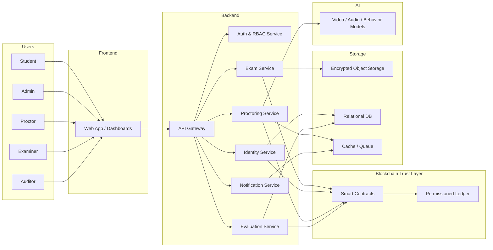

# System Architecture & Technical Stack — IntelliExaChain

## 1) Architecture Principles
- **Permissioned by default:** only approved institutions and nodes participate.
- **Off-chain for heavy data:** files, video, audio, and biometric templates stay off-chain.
- **On-chain for trust:** hashes, timestamps, permissions, access events, and grade proofs stay on-chain.
- **Least privilege:** every role has minimal necessary access.
- **Audit-first:** every critical action produces a traceable event.

---

## 2) High-Level Architecture

---

## 3) Component Breakdown

### 3.1 Frontend
A role-based web application with separate dashboards for:
- Student
- Admin
- Proctor
- Examiner
- Auditor

Responsibilities:
- Authentication UI
- Exam access screen
- Proctoring dashboard
- Evaluation dashboard
- Immutable log explorer
- Result verification screen

### 3.2 API Gateway
Single entry point for clients.
Responsibilities:
- Route requests
- Rate limit
- Validate tokens
- Enforce API versioning

### 3.3 Authentication & RBAC Service
Responsibilities:
- Login / session management
- Wallet linking or DID binding
- Role-based authorization
- Exam participation eligibility checks

### 3.4 Exam Service
Responsibilities:
- Create and schedule exams
- Upload question papers
- Generate access policies
- Release encrypted paper at exact start time
- Manage candidate roster

### 3.5 Identity Service
Responsibilities:
- Candidate enrollment
- Biometric template reference management
- Verification orchestration
- Fallback manual verification flow

### 3.6 Proctoring Service
Responsibilities:
- Webcam/audio event ingestion
- Behavior analysis
- Alert scoring
- Incident logging
- Escalation and review

### 3.7 Evaluation Service
Responsibilities:
- Objective scoring
- Subjective answer routing
- Grade assembly
- Final result compilation
- Verification proof generation

### 3.8 Smart Contract Layer
Contracts should be minimal and focused:
- Exam registry contract
- Access control and release contract
- Submission hash contract
- Scoring proof contract
- Audit event contract

### 3.9 Storage Layer
- **Encrypted object storage:** question papers, response archives, media evidence
- **Relational DB:** users, exams, roles, metadata, workflows
- **Cache / queue:** event processing, autosave, alert streaming

### 3.10 AI Layer
- Gaze anomaly detection
- Multiple face / person detection
- Audio anomaly detection
- Tab-switch and behavior anomaly scoring
- Confidence-based alert generation

---

## 4) Data Flow

### 4.1 Question Paper Flow
1. Admin uploads question paper.
2. Backend encrypts and stores it off-chain.
3. Hash is written to blockchain.
4. At start time, smart contract authorizes decryption key release.
5. Student downloads paper only after authorization.
6. Access event is written to ledger.

### 4.2 Candidate Authentication Flow
1. Student logs in.
2. Identity service checks roster and wallet/DID mapping.
3. Biometric scan is matched against protected reference.
4. Proctor approval is recorded if needed.
5. Access to exam is granted or denied.
6. Outcome is logged immutably.

### 4.3 Submission Flow
1. Student answers questions.
2. Responses autosave locally and to backend.
3. Each checkpoint is hashed.
4. Hash proof is anchored on-chain.
5. Final submission is sealed.
6. Result pipeline consumes final response package.

### 4.4 Evaluation Flow
1. Objective answers are auto-graded.
2. Subjective answers go to examiner review.
3. Final score is assembled.
4. Score proof is written to ledger.
5. Student and admin can verify result integrity.

---

## 5) Smart Contract Design
### Contract 1: ExamRegistry
Stores exam metadata hash, schedule hash, candidate list hash, and status.

### Contract 2: AccessControl
Manages release conditions, unlock timestamp, candidate eligibility, and access grants.

### Contract 3: SubmissionLedger
Stores submission hashes, checkpoint timestamps, and final submission commitment.

### Contract 4: ScoringLedger
Stores objective scoring proof, reviewer actions, and final grade commitment.

### Contract 5: AuditTrail
Stores significant events such as uploads, accesses, alerts, overrides, and modifications.

---

## 6) Recommended Technical Stack

### Frontend
- **Next.js** or **React**
- TypeScript
- Tailwind CSS
- shadcn/ui or Material UI
- Zustand or Redux Toolkit for state
- React Hook Form + Zod for forms
- WebSocket/SSE for live proctoring events

### Backend
- **Node.js with NestJS** or Express
- TypeScript
- REST + WebSocket APIs
- JWT / OAuth2 / SSO integration
- RBAC / ABAC authorization

### Blockchain
- **Hyperledger Fabric** for institutional permissioned deployment  
  or
- **Private Ethereum / Quorum** for EVM compatibility and smart contract portability

### Smart Contracts
- Solidity for EVM-based networks
- Chaincode for Hyperledger Fabric

### Storage
- PostgreSQL for relational data
- Redis for caching and queues
- S3-compatible object storage for encrypted files
- Optional IPFS-like private content-addressed storage for immutable file references

### AI / Proctoring
- Python microservice
- OpenCV
- TensorFlow or PyTorch
- MediaPipe for face/gaze landmarks
- Audio anomaly pipeline
- Event scoring service

### DevOps
- Docker
- Kubernetes
- GitHub Actions
- Prometheus + Grafana
- ELK / OpenSearch for logs
- Secrets Manager / Vault

### Security
- TLS everywhere
- Encryption at rest
- Signed uploads
- HSM / KMS for key management
- Audit logging
- Rate limiting
- Anti-replay tokens

---

## 7) Suggested Deployment Topology
- 1 API gateway
- 1 auth service
- 1 exam service
- 1 identity service
- 1 evaluation service
- 1 proctoring service
- 1 blockchain network with multiple validating nodes
- 1 object storage cluster
- 1 PostgreSQL cluster
- 1 Redis instance/cluster

For hackathon MVP:
- Use a monorepo
- Deploy backend and frontend as a single application cluster
- Run blockchain locally or on a managed test network
- Mock AI alerts with a minimal inference module

---

## 8) Security Controls
- Data minimization for biometrics
- Enrollment-time consent
- Access logs on every privileged action
- End-to-end exam file encryption
- Contract-level time locks
- Replay protection on submissions
- Admin overrides with reason capture
- Immutable history for score changes

---

## 9) API Surface (Illustrative)
- `POST /auth/login`
- `POST /identity/enroll`
- `POST /exams`
- `POST /exams/{id}/question-paper`
- `POST /exams/{id}/release`
- `POST /exams/{id}/start-session`
- `POST /proctoring/events`
- `POST /submissions/checkpoint`
- `POST /submissions/finalize`
- `POST /grading/auto-score`
- `GET /audit/{examId}`
- `GET /results/{examId}/{candidateId}`

---

## 10) MVP Build Order
1. Identity and RBAC
2. Exam creation and scheduling
3. Encrypted paper upload and release
4. Submission checkpointing
5. On-chain audit trail
6. Objective scoring
7. Proctoring alerts
8. Result verification dashboard

---

## 11) Engineering Notes
- Do not place large media blobs on-chain.
- Store hashes, proofs, and event commitments on-chain.
- Keep subjective review outside smart contracts, but anchor review outcomes on-chain.
- Use idempotent event handlers to avoid duplicate chain writes.
- Test contracts on a sandbox chain before production deployment.
