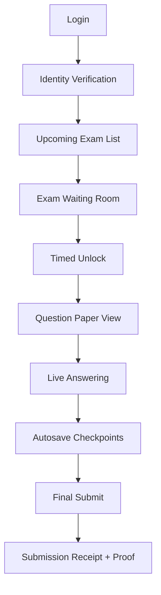
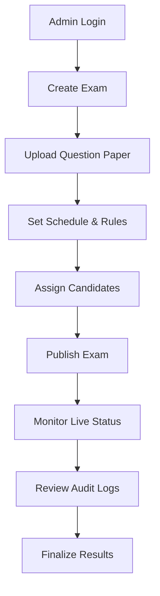

# Design & UI/UX — IntelliExaChain

## 1) Design Goal
Create a trust-heavy, calm, and highly legible interface that feels institutional, modern, and secure. The visual language should communicate:
- reliability
- fairness
- transparency
- intelligence
- control

---

## 2) Design Principles
- **Clarity over decoration**
- **Security cues everywhere**
- **Role-based simplicity**
- **Low cognitive load during exams**
- **Real-time visibility for administrators and proctors**
- **Accessible contrast and typography**

---

## 3) Design System

### Color Direction
- Primary: deep navy / indigo
- Secondary: white and cool gray surfaces
- Success: green
- Warning: amber
- Critical: red
- Accent: cyan for blockchain / trust cues

### Typography
- Headings: geometric sans-serif
- Body: highly readable sans-serif
- Mono: for hashes, wallet IDs, ledger references

### UI Motifs
- Card-based dashboards
- Ledger chips / proof badges
- Time-lock indicators
- Immutable event timeline
- Secure status icons
- Minimal, distraction-free exam mode

---

## 4) Information Architecture
### Public / Auth
- Landing page
- Login
- Role selection
- Consent / privacy notice

### Student Portal
- Identity verification
- Upcoming exams
- Secure exam room
- Submission history
- Results and proof

### Admin Portal
- Exam builder
- Candidate roster
- Scheduling
- Paper vault
- Audit logs
- Reporting

### Proctor Portal
- Live sessions
- Alerts
- Candidate list
- Incident notes
- Escalation actions

### Examiner Portal
- Response review
- Objective scoring
- Subjective marking
- Finalization

### Auditor Portal
- Immutable ledger explorer
- Access history
- Grade history
- Contract verification

---

## 5) Wireframes & User Flows

## 5.1 Student Flow


## 5.2 Admin Flow


---

## 6) Low-Fidelity Wireframes
### 6.1 Landing Page
```text
+------------------------------------------------------+
| LOGO                       Sign In   Request Demo    |
|------------------------------------------------------|
| Hero: "Secure, Fair & Intelligent Examinations"     |
| Subtext: blockchain-backed exam integrity platform   |
| [Get Started]   [View Demo]                          |
|------------------------------------------------------|
| Trust cards: Secure Release | Verified Identity |    |
| Immutable Audit | AI Proctoring | Transparent Grading |
+------------------------------------------------------+
```

### 6.2 Student Dashboard
```text
+------------------------------------------------------+
| Header: Profile | Wallet Status | Notifications      |
|------------------------------------------------------|
| Upcoming Exams                                        |
| - Exam Name | Time | Status | Join                   |
|------------------------------------------------------|
| Identity Verified: Yes/No                             |
| Submission Progress: [#####-----]                    |
| Audit Proof: View Receipt                            |
+------------------------------------------------------+
```

### 6.3 Exam Room
```text
+------------------------------------------------------+
| Exam Title | Time Left | Secure Mode | Live Status    |
|------------------------------------------------------|
| Question Pane                                         |
|                                                      |
| Answer Pane                                           |
|                                                      |
|------------------------------------------------------|
| [Save] [Next] [Flag Question] [Submit Final]         |
+------------------------------------------------------+
```

### 6.4 Proctor Dashboard
```text
+------------------------------------------------------+
| Live Sessions | Risk Alerts | Candidate Queue         |
|------------------------------------------------------|
| Student A | Camera OK | Low Risk                      |
| Student B | Suspicious Movement | Medium             |
| Student C | Audio Anomaly | High                      |
|------------------------------------------------------|
| Selected Session: video preview + timeline + notes    |
+------------------------------------------------------+
```

---

## 7) High-Fidelity Mockup Directions
### 7.1 Landing Page
- Hero section with trust-focused headline
- Animated blockchain proof line
- Three-column feature cards
- CTA buttons with subtle glow
- Institutional illustration style

### 7.2 Student Dashboard
- Clean exam list with status chips
- Wallet / identity verified badge
- Countdown clock for scheduled exams
- Receipt panel showing submission proof
- Minimal distractions

### 7.3 Secure Exam Mode
- Two-panel layout: questions left, answers right
- Sticky timer and secure status banner
- Autosave progress indicator
- In-app alerts only for system state, not marketing noise
- Full-screen exam option

### 7.4 Proctor Dashboard
- Multi-stream session grid
- Alert severity colors
- Timeline scrubber for incidents
- Candidate detail drawer
- Quick action buttons: warn, escalate, manual verify

### 7.5 Admin Dashboard
- Exam lifecycle cards
- Roster management table
- Paper vault
- Blockchain proof viewer
- Export center for reports and logs

---

## 8) Interaction Design
- Countdown timer begins in waiting room
- Exam paper unlock transition should be explicit and animated
- All critical actions require confirmation
- Alert cards should support one-click escalation
- Every submitted action should produce a proof receipt
- Use skeleton loading for chain confirmations

---

## 9) Accessibility
- WCAG-conscious contrast ratios
- Keyboard navigability
- Screen-reader labels for all controls
- Reduced motion mode
- Clear status text alongside icons
- Large hit targets for exam actions

---

## 10) UX Risks and Remedies
### Risk: Blockchain terminology may overwhelm students
Remedy: hide technical complexity behind simple language such as “Verified”, “Locked”, and “Proof Saved”.

### Risk: Exam-time stress increases friction
Remedy: keep the exam UI sparse, stable, and predictable.

### Risk: Proctor dashboards become noisy
Remedy: severity filters, alert grouping, and timeline summaries.

### Risk: Too many steps during authentication
Remedy: progressive verification with clear status feedback.

---

## 11) Prototype Deliverables
- Low-fidelity wireframes for all core roles
- Clickable dashboard prototype
- Exam room prototype
- Proctor alert prototype
- Audit ledger prototype
- Result verification prototype

---

## 12) Suggested Screen List
1. Landing Page
2. Login / Role Selection
3. Student Identity Verification
4. Student Dashboard
5. Exam Waiting Room
6. Secure Exam Room
7. Submission Receipt Screen
8. Admin Dashboard
9. Exam Builder
10. Proctor Dashboard
11. Examiner Review Screen
12. Auditor Ledger Explorer
13. Notification and Annoucement for Each Examination
14. Video Conferencing for Proctoring

