# 🚀 IntelliExaChain

### 🔐 Trust Every Exam. Verify Every Result.

### AI-Powered • Blockchain-Backed • Next-Generation Examination Infrastructure

  

---

### 🌍 The Future Infrastructure of Global Examinations

**Secure • Fair • Transparent • Scalable • Intelligent**

Conduct examinations for:

🎓 Universities • 📚 EdTech Platforms • 🏫 Schools • 🏆 Competitive Exams • 💼 Recruitment Tests • 📜 Certifications

---

# 📖 Overview

## What is IntelliExaChain?

**IntelliExaChain** is an AI-powered, Blockchain-backed Examination Infrastructure Platform designed to transform how examinations are conducted globally.

By integrating:

🤖 Artificial Intelligence

⛓️ Blockchain Technology

📜 Smart Contracts

🔐 Cryptographic Security

🪪 Digital Identity Verification

the platform establishes a trusted ecosystem for conducting secure, transparent, scalable, and tamper-proof examinations.

Unlike traditional examination systems, IntelliExaChain creates a decentralized trust layer where every critical examination event is verifiable, auditable, and immutable.

Whether conducting:

- A school assessment for 100 students
- A university semester examination for 50,000 candidates
- A national entrance examination for millions of applicants

IntelliExaChain guarantees integrity at every stage.

---

# 🎯 Vision

> To become the trust infrastructure powering the future of examinations worldwide.

We envision a future where:

✅ Paper Leaks are impossible

✅ Results cannot be manipulated

✅ Certificates are instantly verifiable

✅ Students are fairly evaluated

✅ Examination authorities can conduct assessments at any scale

---

# 🚨 Problem Statement

Current examination systems face significant challenges:

### Security Issues

- Question Paper Leaks
- Candidate Impersonation
- Result Manipulation
- Certificate Fraud

### Operational Issues

- Manual Verification
- Delayed Evaluation
- Limited Transparency
- Lack of Audit Trails

### Scalability Issues

- Infrastructure Bottlenecks
- Difficulty Managing Millions of Candidates
- High Operational Costs

---

# 💡 Solution

IntelliExaChain combines Blockchain and AI to build a complete Examination Lifecycle Platform.

The system:

- Generates intelligent examination papers
- Stores papers in blockchain vaults
- Releases papers using smart contracts
- Authenticates candidates through biometrics
- Monitors exams using AI
- Records submissions immutably
- Evaluates answers using AI + Faculty
- Issues blockchain-verified certificates

---

# 🖼️ Product Showcase

## 🏠 Landing Page Prototype

---

## 🖥️ Institution Dashboard

---

## 📱 Student Mobile Application

---

## 🔄 System Workflow

---

## 🏗️ System Architecture Diagram

---

# 🌍 Supported Examination Ecosystem

<table>
<tr>
<th>Category</th>
<th>Examples</th>
</tr>

<tr>
<td>🏫 School Examinations</td>
<td>CBSE, ICSE, State Boards</td>
</tr>

<tr>
<td>🎓 University Examinations</td>
<td>UG, PG, PhD Programs</td>
</tr>

<tr>
<td>📚 EdTech Assessments</td>
<td>PW, Unacademy, Vedantu, BYJU'S</td>
</tr>

<tr>
<td>🏆 Competitive Examinations</td>
<td>JEE, NEET, GATE, CAT, CUET, UPSC</td>
</tr>

<tr>
<td>💼 Recruitment Examinations</td>
<td>SSC, Banking, Railways, Defence</td>
</tr>

<tr>
<td>📜 Certifications</td>
<td>NPTEL, Industry Certifications</td>
</tr>

<tr>
<td>🏢 Corporate Assessments</td>
<td>Skill Testing & Hiring</td>
</tr>

</table>

---

# ✨ Core Features

## 🤖 AI Question Intelligence

- AI Question Generation
- Question Difficulty Balancing
- Bloom Taxonomy Mapping
- Multi-language Paper Creation
- Personalized Assessments

---

## ⛓️ Blockchain Question Vault

- Immutable Storage
- Encrypted Question Papers
- Decentralized Access
- Tamper-Proof Security
- Audit Trails

---

## 📜 Smart Contract Exam Delivery

Question papers remain locked until:

✅ Scheduled Start Time

✅ Candidate Authentication

✅ Smart Contract Verification

---

## 🪪 Candidate Authentication

- Facial Recognition
- Biometric Verification
- Identity Validation
- Web3 Academic Identity
- Anti-Impersonation Detection

---

## 🎥 AI-Powered Proctoring

Real-time monitoring through:

- Eye Tracking
- Face Detection
- Audio Monitoring
- Device Tracking
- Behavioral Analytics

All suspicious events are permanently recorded on blockchain.

---

## 📝 Blockchain Answer Recording

- Continuous Autosave
- Encrypted Storage
- Distributed Ledger Recording
- Tamper-Proof Submission

---

## ⚖️ Dual Evaluation Engine

### Layer 1

🤖 AI Evaluation

### Layer 2

👨‍🏫 Faculty Evaluation

### Layer 3

⛓️ Blockchain Verification

---

## 📜 Blockchain Certificates

- QR Verification
- NFT Credentials
- Academic Identity Wallet
- Employer Verification

---

## 📊 Analytics & Intelligence

Institutions gain:

- Candidate Insights
- Integrity Scores
- Exam Health Monitoring
- Fraud Detection Analytics
- Regional Performance Metrics

---

# 🔄 Examination Lifecycle

```mermaid
flowchart LR

A[Create Examination]
--> B[AI Question Generation]

B --> C[Blockchain Vault Storage]

C --> D[Identity Verification]

D --> E[Smart Contract Release]

E --> F[Live AI Proctoring]

F --> G[Answer Submission]

G --> H[Blockchain Recording]

H --> I[AI Evaluation]

I --> J[Faculty Evaluation]

J --> K[Results Publication]

K --> L[Blockchain Certificate]
```

---

# 🏗️ Technology Stack

## Frontend

| Technology | Purpose |
|------------|----------|
| Next.js | Frontend Framework |
| React.js | User Interface |
| TailwindCSS | Styling |
| Framer Motion | Animations |
| TypeScript | Development |

---

## Backend

| Technology | Purpose |
|------------|----------|
| Node.js | Runtime |
| NestJS | Backend Framework |
| GraphQL | API Layer |
| Redis | Caching |

---

## AI Layer

| Technology | Purpose |
|------------|----------|
| TensorFlow | Deep Learning |
| OpenCV | Face Recognition |
| MediaPipe | Eye Tracking |
| YOLO | Object Detection |
| Whisper | Audio Analysis |

---

## Blockchain Layer

| Technology | Purpose |
|------------|----------|
| Hyperledger Fabric | Permissioned Blockchain |
| Ethereum Private Network | Smart Contracts |
| Solidity | Contract Development |
| IPFS | Distributed Storage |

---

## Cloud Infrastructure

| Technology | Purpose |
|------------|----------|
| AWS | Hosting |
| Docker | Containerization |
| Kubernetes | Scaling |
| CloudFront | CDN |

---
## 🧑‍💻 Recommended Technical Stack

### Frontend
- **Next.js** or **React**
- TypeScript
- Tailwind CSS
- shadcn/ui or Material UI
- Zustand or Redux Toolkit for state
- React Hook Form + Zod for forms
- WebSocket/SSE for live proctoring events

### Backend
- **Node.js with NestJS** or Express
- TypeScript
- REST + WebSocket APIs
- JWT / OAuth2 / SSO integration
- RBAC / ABAC authorization

### Blockchain
- **Hyperledger Fabric** for institutional permissioned deployment  
  or
- **Private Ethereum / Quorum** for EVM compatibility and smart contract portability

### Smart Contracts
- Solidity for EVM-based networks
- Chaincode for Hyperledger Fabric

### Storage
- PostgreSQL for relational data
- Redis for caching and queues
- S3-compatible object storage for encrypted files
- Optional IPFS-like private content-addressed storage for immutable file references

### AI / Proctoring
- Python microservice
- OpenCV
- TensorFlow or PyTorch
- MediaPipe for face/gaze landmarks
- Audio anomaly pipeline
- Event scoring service

### DevOps
- Docker
- Kubernetes
- GitHub Actions
- Prometheus + Grafana
- ELK / OpenSearch for logs
- Secrets Manager / Vault

### Security
- TLS everywhere
- Encryption at rest
- Signed uploads
- HSM / KMS for key management
- Audit logging
- Rate limiting
- Anti-replay tokens

---

## Suggested Deployment Topology
- 1 API gateway
- 1 auth service
- 1 exam service
- 1 identity service
- 1 evaluation service
- 1 proctoring service
- 1 blockchain network with multiple validating nodes
- 1 object storage cluster
- 1 PostgreSQL cluster
- 1 Redis instance/cluster
---

# 🎨 UI/UX Design Philosophy

### Design Principles

✨ Trust by Design

✨ Enterprise Ready

✨ Accessibility First

✨ Mobile First

✨ Modern SaaS Experience

✨ Dark & Light Themes

### Inspiration

- Stripe Dashboard
- Notion
- AWS Console
- Modern EdTech Platforms

---

# 🏆 Competitive Advantages

| Traditional Platforms | IntelliExaChain |
|----------------------|-----------------|
| Centralized Systems | Decentralized Trust |
| Manual Evaluation | AI + Human Evaluation |
| Paper Leak Risks | Blockchain Vault |
| Editable Results | Immutable Results |
| Fake Certificates | Blockchain Verified |
| Limited Audits | Full Audit Trails |
| Small Scale | Millions of Candidates |

---

# 📈 Roadmap

### Phase 1

✅ AI Examination Platform

✅ Blockchain Vault

✅ AI Proctoring

---

### Phase 2

🚀 National Examination Infrastructure

🚀 University Integrations

🚀 Government Exam Support

---

### Phase 3

🌍 Global Academic Identity

🌍 Blockchain Credentials

🌍 International Certifications

---

### Phase 4

🤖 Autonomous Examination Ecosystem

🤖 Fully Intelligent Assessment Systems

---

# 👨‍💻 Team Visionary Coders

<table>
<tr>

<td align="center">
 
<b>Vaibhav Shaw</b> 
Team Leader & Product Strategist 
Product Manager & AI Proficient
</td>

<td align="center">
 
<b>Ishant Joshi</b> 
Frontend Developer 
AI Proficient
</td>

<td align="center">
 
<b>Md. Aftab Uddin</b> 
Backend Developer 
Presentation 
</td>

</tr>
</table>

---

# 🤝 Partners & Integrations

### Educational Ecosystem

🏫 Universities

📚 EdTech Platforms

🏛 Examination Boards

💼 Recruitment Agencies

📜 Certification Authorities

---

# 📜 License

Licensed under the MIT License.

See the LICENSE file for more information.

---

# ⭐ Support The Project

If you believe examinations deserve trust, transparency, and intelligence:

🌟 Star this repository

🍴 Fork this repository

🚀 Build with us

---

# 🔐 IntelliExaChain

### Trust Every Exam. Verify Every Result.

### AI + Blockchain + Education

**Made with ❤️ by Team Visionary Coders**

